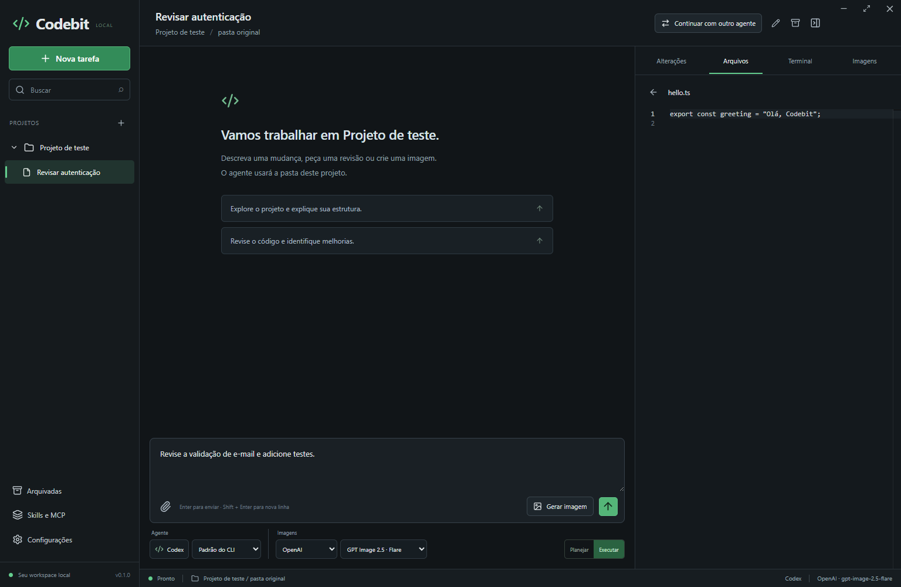

# Codebit

Harness desktop pessoal para Windows que reúne Codex CLI, Claude Code, Devin CLI e geração de imagens em uma interface comum. O aplicativo usa os CLIs e logins da máquina; os modelos de imagem são selecionados separadamente por tarefa.



## Executar

Abra `release/Codebit-0.2.5-Windows.exe`. É um executável portátil: não exige instalar o Codebit nem Node.js. Os CLIs continuam sendo pré-requisitos; instalações npm do Codex precisam do Node que já usam. A partir da 0.2.4, o Codebit se atualiza sozinho quando você clica no aviso de versão nova (veja **Atualizações do Codebit**). Em versões anteriores, feche a versão antiga e abra a nova. O diretório de dados e as tarefas são preservados.

1. Abra uma pasta e crie uma tarefa com Codex, Claude ou Devin, ou comece uma **conversa sem projeto** pelo **+** de **Conversas**.
2. Confirme a confiança na pasta para habilitar agentes e terminal. Conversas sem projeto usam uma pasta do Codebit e não pedem confirmação.
3. O catálogo de modelos é consultado automaticamente ao abrir o aplicativo. Escolha o **Agente**, o **Modelo** e o **Esforço**, abaixo da conversa. O botão ↻ atualiza a lista. Se necessário, faça o login no terminal com `codex login`, `claude auth login` ou `devin auth login` e atualize o catálogo.
4. Escolha **Planejar**, **Executar** ou **Bypass**, escreva a mensagem e envie. Aprovações e perguntas aparecem na conversa. Imagens podem ser coladas direto no campo de mensagem.
5. As imagens usam o Codex CLI e seu login por padrão. Para usar a API OpenAI ou o ComfyUI, configure o provedor em **Configurações → Imagens** e escolha-o no seletor **Imagens**, abaixo da conversa.

O binário é local e não possui assinatura comercial nem atualização automática.

## Recursos

- Descoberta de instalações de Codex, Claude e Devin no PATH e em diretórios conhecidos (inclusive o Devin CLI embutido no Devin Desktop), com seleção manual de executável.
- Troca de agente no mesmo chat: cada agente mantém a própria sessão nativa e recebe, na próxima mensagem, a parte da conversa que ainda não viu.
- Skills e comandos pelo chat: digite `/` no início da mensagem para buscar o que o agente oferece.
- Modo Multitarefa: várias tarefas lado a lado, em paralelo, com aprovações, contexto e resposta direto em cada cartão.
- Fila de mensagens: enquanto o agente trabalha, novas mensagens entram numa lista que pode ser editada, reordenada ou enviada na hora.
- Comandos e sub-agentes em segundo plano: a sessão continua aberta até eles terminarem, e o agente pode relatar o resultado sozinho.
- Prompts salvos no menu lateral, globais ou por projeto, executados à parte da conversa num painel temporário.
- Imagens citadas na conversa, nas linhas de execução ou nos anexos abrem no painel lateral com um clique.
- Atualização pelo próprio app: um clique no aviso de versão nova espera as tarefas terminarem e reabre o Codebit na versão nova, na mesma tarefa.
- Aviso de conflito quando conversas paralelas alteram o mesmo arquivo, e notificações do Windows quando uma tarefa termina, falha ou precisa de você.
- Cota do plano de cada agente na barra de status, com as janelas de uso e os horários de renovação.
- "Ocultar contexto": mostra só a conversa, sem as execuções de ferramentas e aprovações já respondidas.
- Uso de contexto do modelo na barra de status, atualizado a cada resposta.
- Ao abrir uma tarefa ou voltar para o chat, a conversa abre nas mensagens mais recentes.
- Sub-agentes: o agente principal delega tarefas a sub-agentes com CLI, modelo, esforço e limite simultâneo escolhidos por tarefa.
- Conversas sem projeto, em uma pasta própria do Codebit.
- Diretrizes para os agentes: instruções permanentes enviadas a Codex, Claude e Devin. A padrão autoriza atualizar CLIs desatualizados, e o Codebit detecta sozinho a nova versão.
- Catálogo automático de modelos informado pelo CLI, atualização manual e identificador manual como alternativa.
- Esforço de raciocínio por modelo, com níveis informados pelo CLI e escolha persistida por tarefa, inclusive nas retomadas.
- Conversas em streaming, retomada da sessão nativa, interrupção, anexos (inclusive imagens coladas), histórico SQLite, busca e arquivamento.
- Aprovações de ferramentas e respostas a perguntas dos agentes.
- Pasta original como padrão, várias conversas em paralelo no mesmo projeto e opção de worktree Git baseada em HEAD. Mudanças não commitadas não são copiadas para a worktree.
- Transferência de contexto editável para uma nova tarefa ligada à original, com outro agente.
- Terminal PowerShell interativo, navegador de arquivos e visualização de alterações Git. A prévia de arquivos é somente leitura.
- Skills locais por agente, botão para incluí-las na mensagem e conexões MCP adicionais.
- Geração e edição de imagens por comando direto ou ferramenta MCP interna; galeria, metadados e exportação PNG. Toda imagem gerada aparece no chat, inclusive as criadas pelo Codex com a ferramenta de imagem própria dele.

Arquivar preserva a conversa e os arquivos. Worktrees também são preservadas. Conversas do mesmo projeto rodam ao mesmo tempo na mesma pasta, sem esperar a vez. Divida o trabalho para que não editem os mesmos arquivos, ou use uma worktree. Terminais e programas externos também podem alterar a pasta.

O painel de alterações limita a prévia do diff a 512 KB e a lista de arquivos a 128 KB. Quando ultrapassa esses limites, um aviso indica a prévia parcial; use o Git no terminal para consultar o restante. A versão 0.1.1 corrige o erro `RangeError: Invalid string length` ao abrir projetos com saídas grandes do Git.

## Modelos e esforço

As listas vêm da instalação selecionada e do acesso configurado nela, sem tabela fixa de modelos. O carregamento é independente por agente e não envia uma mensagem ao modelo. Falhas de autenticação ou catálogo aparecem em **Configurações → Agentes**; o botão ↻ ao lado do modelo permite tentar novamente.

Escolha um modelo explícito para habilitar os esforços que ele anuncia. No Codex, **Padrão · Médio**, por exemplo, aplica o padrão anunciado pelo modelo; no Claude, **Padrão do CLI** utiliza sua configuração nativa. **Padrão do CLI** no seletor de modelo mantém a escolha nativa de modelo e esforço. Modelos manuais ou sem capacidades anunciadas continuam disponíveis, com esforço controlado pelo CLI. Um esforço incompatível é limpo ao trocar de modelo. Alterações de modelo e esforço são aplicadas à próxima mensagem e preservam a sessão da tarefa.

Integrações: [`model/list` e `turn/start` do Codex App Server](https://learn.chatgpt.com/docs/app-server) e [configuração de modelo e esforço do Claude Code](https://code.claude.com/docs/en/model-config).

### Devin CLI

O Codebit usa o Devin CLI pelo protocolo ACP (`devin acp`) e encontra também a cópia instalada com o Devin Desktop, em `%LOCALAPPDATA%\Programs\Devin\resources\app\extensions\windsurf\devin\bin\devin.exe`. O Devin Desktop não precisa estar aberto; o login é o do próprio CLI (`devin auth status`). O catálogo vem de `devin models list` e inclui, por exemplo, SWE-2 High/Medium/Max. No Devin, cada variante já define o nível de raciocínio, então o seletor de esforço fica desativado.

Limitação do Devin CLI 3000.10: ele inicia os servidores MCP enviados pelo Codebit, mas suas ferramentas MCP só enxergam os servidores configurados no próprio Devin. Como agente principal, o Devin ainda não usa `codebit_images` nem `run_subagents`; o botão **Gerar imagem** continua funcionando. Como sub-agente, o Devin funciona normalmente.

### Trocar de agente e sub-agentes

O seletor **Agente** troca o agente da tarefa sem sair da conversa. Cada agente retoma a própria sessão nativa. Na primeira mensagem após a troca, o Codebit inclui o trecho da conversa que o novo agente ainda não viu (até cerca de 24 mil caracteres). **Continuar com outro agente** segue disponível para criar uma tarefa vinculada.

Em **Sub-agentes**, abaixo da conversa, ative a delegação e escolha CLI, modelo, esforço e quantidade simultânea (1 a 8). O agente principal recebe a ferramenta `run_subagents` do MCP interno `codebit_agents`. Cada sub-agente roda uma tarefa independente, na mesma pasta e no mesmo modo da tarefa, sem acesso à conversa e sem MCPs internos. Chamadas acima do limite aguardam na fila. O progresso e as aprovações dos sub-agentes aparecem na conversa principal. Como compartilham a pasta, peça tarefas que não editem os mesmos arquivos.

### Diretrizes para os agentes

Em **Configurações → Agentes → Diretrizes para os agentes**, escreva instruções permanentes. O Codebit as envia a Codex, Claude e Devin no início de cada sessão: no Codex, como instruções de desenvolvedor; no Claude, com `--append-system-prompt`; no Devin, que não tem prompt de sistema no ACP, junto da primeira mensagem. As diretrizes novas valem a partir da próxima sessão de cada tarefa. **Restaurar padrão** recupera o texto original.

A diretriz padrão autoriza o agente a atualizar diretamente uma ferramenta ou CLI desatualizado (Codex, Claude Code, Devin ou suas dependências), sem pedir confirmação, e a atualizar as informações internas que dependem da versão. Quando a instalação é gerenciada por outro aplicativo, como o Devin CLI do Devin Desktop, o agente explica como atualizar em vez de forçar.

Ao fim de cada resposta e quando a janela volta ao foco, no máximo uma vez por minuto, o Codebit confere a versão dos CLIs selecionados. Isso inclui atualizações feitas no terminal. Se um agente tiver atualizado algum deles, o Codebit refaz a descoberta sem precisar reiniciar e recarrega versão, login, catálogo de modelos, skills, comandos e cota.

## Imagens

### Codex (login local)

Provedor padrão das novas tarefas. O Codebit inicia um App Server efêmero do Codex CLI detectado em **Agentes**, em sandbox somente leitura, e usa a ferramenta nativa de geração de imagens com o login da máquina, sem chave da API. O uso conta nos limites da sua assinatura do Codex. O modelo de imagem é escolhido pelo Codex e não pode ser selecionado pelo cliente. As dimensões são enviadas como preferência no pedido.

Tarefas criadas antes desta versão mantêm o provedor salvo. Troque para **Codex · Login local** no seletor **Imagens**. **Verificar acesso** consulta se o provedor configurado no Codex oferece geração de imagens. O Codex também guarda uma cópia de cada imagem em `~/.codex/generated_images`.

### OpenAI

Salve uma chave da API em **Configurações → Imagens** ou inicie o aplicativo com `OPENAI_API_KEY` no ambiente. A chave salva usa a criptografia do Windows via Electron safeStorage e não é devolvida à interface.

A conta da API é separada da assinatura usada pelo Codex. O catálogo de GPT Image é cruzado com `/v1/models`; um modelo listado ainda pode depender de acesso, cota e compatibilidade da operação. O aplicativo mantém o modelo escolhido e não repete automaticamente gerações que falham.

### ComfyUI

Inicie seu servidor ComfyUI e salve o endereço, por padrão `http://127.0.0.1:8188`. **Verificar conexão** consulta os nós e modelos instalados. Os presets incluídos suportam SDXL para geração e edição; os checkpoints precisam ter nomes identificáveis como SDXL. Outros modelos podem ser usados por workflows importados.

Exporte seu workflow no **formato API JSON**, importe-o e mapeie os campos relevantes como `6.inputs.text`. Para edição, mapeie também `image` para o nó que recebe a imagem enviada. O workflow deve produzir PNG com um nó de saída de imagem. Dependências ausentes são indicadas no catálogo.

Para editar, anexe PNG/JPEG/WebP e clique no lápis do anexo, ou use **Editar** em uma imagem gerada. Os presets SDXL trocam automaticamente para imagem-para-imagem. Workflows personalizados de edição precisam ser selecionados pelo usuário. Escreva a alteração e clique em **Gerar imagem**. Remova a referência para voltar à geração a partir de texto.

Cancelar encerra a espera do Codebit. Uma requisição já enviada à OpenAI pode ser concluída e cobrada. No ComfyUI, o aplicativo remove apenas seu próprio item pendente; não interrompe globalmente trabalhos em execução de outros clientes.

### Imagens mencionadas no chat

Caminhos de imagem citados na conversa viram links: nas respostas (texto ou `código`), nas linhas de execução, como `Edit · C:\projeto\img\tela.png`, e nos anexos. Valem caminhos absolutos, `~/…` e caminhos relativos à pasta da tarefa. Ao clicar, a imagem abre na aba **Imagens** do painel lateral, com o caminho completo e os botões **Abrir no app padrão** e **Mostrar na pasta**. A seta volta às imagens da tarefa. Imagens em Markdown com caminho local (``) aparecem no próprio chat. Formatos: PNG, JPEG, GIF, WebP, BMP e SVG. O Codebit só entrega arquivos com essas extensões, então um caminho citado no chat não expõe outros arquivos.

## Skills e MCP

Os CLIs continuam responsáveis por suas configurações, extensões e permissões nativas. O Codebit lista skills locais nas pastas usuais do usuário/projeto e os nomes de servidores MCP encontrados nas configurações. Plugins gerenciados pelo CLI podem funcionar mesmo sem aparecer nessa lista.

### Skills e comandos no chat

Digite `/` no início da mensagem para abrir a lista de skills e comandos do agente da tarefa. Use ↑/↓ para navegar, Enter ou Tab para escolher e Esc para fechar. A lista vem do próprio CLI, na pasta da tarefa, e é atualizada a cada poucos minutos ou pelo botão ↻:

- **Claude:** comandos e skills anunciados pelo Claude Code, executados como `/nome argumentos`.
- **Codex:** skills de `skills/list`, inseridas como `$nome` e enviadas ao Codex como skill.
- **Devin:** skills de `devin skills list` e, depois da primeira mensagem, os comandos anunciados pelo ACP (`/compact`, `/context`…), executados como `/nome`.

Em projetos ainda não confiáveis, a lista só aparece depois da confirmação, porque consultar o CLI carrega as configurações do projeto.

### Modo Multitarefa

**Multitarefa**, na barra lateral, abre um quadro com várias tarefas lado a lado. Cada cartão mostra:

- o agente, o modelo e o status;
- as últimas mensagens e execuções, com as imagens geradas;
- os pedidos de aprovação ou perguntas pendentes, que dá para responder ali mesmo;
- o uso de contexto e a fila;
- um campo para responder. Com o agente trabalhando, a mensagem entra na fila.

Para colocar uma tarefa no quadro, arraste-a da barra lateral até a área **Solte aqui para iniciar**, ou escolha-a no seletor da mesma área. O campo **Descreva uma nova tarefa…**, embaixo, cria uma tarefa já no quadro e a inicia com essa mensagem. Nele você escolhe o projeto (ou uma conversa sem projeto) e o agente, e a primeira linha vira o título.

Todas as tarefas rodam ao mesmo tempo, inclusive várias no mesmo projeto e na mesma pasta. Peça partes que não editem os mesmos arquivos. Para isolar uma tarefa em um projeto Git, marque **Worktree isolada**; ela ganha a própria worktree a partir do commit atual. Conversas sem projeto já têm pastas próprias. Os botões do cartão abrem a conversa completa, interrompem a execução ou tiram a tarefa do quadro sem apagá-la.

### Fila de mensagens

Enquanto o agente responde, o campo de mensagem continua livre: Enter ou o botão de fila adicionam a mensagem, com anexos, à **Fila** da tarefa, acima do campo. Quando a resposta termina normalmente, o próximo item é enviado sozinho. Depois de uma falha ou interrupção, a fila espera você. Em projetos ainda não confiáveis, nada é enviado automaticamente. A fila fica salva na tarefa.

Cada item pode ser editado (Enter salva, Esc cancela), movido pelos botões ou arrastando, removido ou enviado na hora. **Enviar agora** manda direto quando o agente está parado. Durante uma resposta do Codex, a mensagem entra na resposta em andamento (`turn/steer`). No Claude e no Devin, que respondem uma mensagem por vez, ela passa a ser a próxima e sai assim que a resposta atual terminar.

### Comandos e sub-agentes em segundo plano

Quando o turno termina com comandos ou sub-agentes ainda rodando, o Codebit não encerra o CLI, o que os interromperia. A conversa mostra quantos seguem em segundo plano, e a barra de status indica **Em segundo plano**. A próxima mensagem vai para a mesma sessão. O agente, a pasta, o modelo, o esforço e o modo ficam bloqueados até o trabalho terminar. **Interromper** encerra a sessão e tudo o que ela iniciou.

- **Claude Code:** comandos com `run_in_background` e sub-agentes em segundo plano. Quando terminam, o próprio Claude começa um turno para relatar o resultado, que aparece na conversa. Mensagens internas dos sub-agentes não entram na resposta; as ferramentas que eles usam aparecem como `Sub-agente · …`.
- **Codex:** comandos que o turno deixou rodando, como um servidor de desenvolvimento, e sub-agentes em threads próprias. Eventos dessas threads não encerram nem preenchem a conversa principal. Como o Codex não retoma sozinho, a sessão fecha alguns segundos depois que tudo termina.
- **Devin:** o protocolo ACP não informa trabalho em segundo plano, então a sessão fecha ao fim do turno, como antes.

Ao fechar o Codebit, as sessões e o trabalho em segundo plano também terminam; essas tarefas reabrem como interrompidas.

### Prompts salvos

A seção **PROMPTS** do menu lateral guarda pedidos rápidos, criados pelo **+**. Cada um tem nome, texto, escopo e permissão:

- **Escopo:** todos os projetos e conversas, ou só um projeto. Os de projeto aparecem quando uma tarefa dele está aberta.
- **Permissão:** Só leitura (padrão), Executar ou Bypass.

Clicar num prompt o executa numa sessão à parte, com o agente e o modelo da tarefa aberta. Ele não entra na conversa nem espera a fila dela. O resultado aparece num painel temporário, que lista as execuções desta sessão do Codebit e mostra aprovações quando o modo pede. **Levar para uma conversa** cria uma conversa com o pedido e a resposta, que retoma a mesma sessão do agente. **Descartar** apaga a execução. Os prompts ficam salvos no banco do Codebit, independentes das versões do app. No Claude, "Só leitura" usa o modo de planejamento; como o prompt nunca sai dele, o Codebit recusa sozinho o pedido de sair do planejamento e o Claude responde direto.

### Conflitos entre conversas

Quando duas conversas na mesma pasta alteram o mesmo arquivo em execuções que se sobrepõem, as duas recebem um aviso com o nome do arquivo e da outra conversa. Isso acontece se a outra alterou o arquivo durante esta execução, ou se ainda está trabalhando. Conversas uma depois da outra não geram aviso. Worktrees têm pastas próprias e nunca entram em conflito. A detecção usa as ferramentas de edição de cada CLI: `fileChange` no Codex, `Edit`/`Write` no Claude e edições no Devin, inclusive as de sub-agentes. Alterações feitas por comandos de terminal (`sed`, scripts) não são detectadas.

### Atualizações do Codebit

O Codebit procura versões novas na pasta de onde foi aberto, normalmente `release`, ou na pasta escolhida em **Configurações → Agentes → Atualizações do Codebit**. Ele confere a pasta a cada minuto e quando a janela volta ao foco. Uma versão conta como disponível quando o arquivo `Codebit-X.Y.Z-Windows.exe` tem ao lado um `.sha256` que confere com ele; assim, uma versão ainda sendo gerada não aparece.

Quando há versão nova, o rodapé do menu lateral mostra **vX.Y.Z disponível · Atualizar**. Ao clicar, o Codebit espera até nenhum agente estar trabalhando, aguardando você ou com comandos em segundo plano, e até terminarem prompts salvos e gerações de imagem; enquanto isso, o aviso oferece **Cancelar**. Depois, ele abre a versão nova e se fecha. A versão nova espera a antiga terminar e reabre na mesma tarefa. As conversas continuam na mesma sessão nativa dos agentes. Terminais abertos no painel lateral são fechados.

### Notificações

Com o Codebit em segundo plano, o Windows avisa quando uma tarefa termina, falha, precisa de você (aprovação ou pergunta) ou entra em conflito, e também quando um prompt salvo termina. Clicar no aviso abre a tarefa. Enquanto a fila ainda tem mensagens para enviar, o aviso de término espera a última. Para o Windows mostrar notificações de um app portátil, o Codebit registra o próprio nome em `HKCU\Software\Classes\AppUserModelId\local.codebit.desktop` ao iniciar. Desative em **Configurações → Agentes → Notificações**.

### Cota do plano

O indicador **Cota** na barra de status mostra o maior uso entre as janelas do plano do agente da tarefa. Clique nele para ver cada janela, o horário de renovação e o plano. A leitura vem do CLI, não gasta cota e é refeita a cada 2 minutos no máximo, ou pelo botão ↻. Durante as respostas, o valor é atualizado com os dados que o CLI envia.

- **Codex:** `account/rateLimits/read` (janelas de 5 horas e semanal, créditos e plano).
- **Claude:** o comando local `/usage` do Claude Code (sessão de 5 horas, semana e semana por modelo) e o `rate_limit_event` das respostas.
- **Devin:** o plano de `devin auth status`. O Devin CLI não informa o saldo da conta; o consumo de cada sessão aparece com `/usage` no chat.

### Ocultar contexto

**Ocultar contexto**, no topo da tarefa, tira do chat as execuções de ferramentas e os pedidos de aprovação já respondidos, deixando só a conversa. Pedidos pendentes, erros e imagens continuam visíveis. A escolha fica salva. Conversas longas também respondem mais rápido: cada mensagem só é redesenhada quando muda, e a digitação não redesenha o histórico.

### Uso de contexto

A barra de status mostra quanto da janela de contexto do modelo ainda está livre, com base no uso informado pelo agente na última resposta (tokens de entrada, cache e saída da chamada mais recente). O Codex e o Claude informam o tamanho da janela junto com o uso. No Devin, o catálogo já traz esse tamanho antes da primeira mensagem. Trocar de agente ou de modelo limpa a leitura até a próxima resposta.

Conexões adicionadas no Codebit recebem o prefixo `codebit_` e são aplicadas à próxima execução, sem escrever nas configurações nativas. Para um servidor stdio, use caminho/comando e argumentos separados. Variáveis podem referenciar o ambiente sem copiar o segredo:

```json
{
  "id": "meu-servidor",
  "name": "meu-servidor",
  "agent": "both",
  "enabled": true,
  "transport": "stdio",
  "command": "C:\\ferramentas\\servidor.exe",
  "args": [],
  "env": { "TOKEN": "${MINHA_VARIAVEL}" }
}
```

`agent` aceita `codex`, `claude`, `devin` ou `both` (todos os agentes). Para HTTP, use `transport: "http"` e `url`; o Devin recebe apenas servidores stdio. A autenticação interativa de servidores nativos continua no CLI. Os nomes `images` e `agents` são reservados às pontes internas de imagens e sub-agentes, que usam credenciais locais temporárias por tarefa.

## Permissões e dados

O renderer não tem acesso direto ao Node: usa preload isolado e operações IPC validadas. Arquivos de prévia ficam restritos à pasta de trabalho. Os CLIs são processos nativos, executados sem interpolação de prompts em shell.

No Codex, **Planejar** usa sandbox somente leitura e **Executar** usa workspace-write, com aprovações encaminhadas ao usuário, inclusive para ferramentas MCP. No Claude, os modos são os nativos `plan` e `manual`. No Devin, são `plan` e `accept-edits` (edições no workspace aprovadas automaticamente; comandos pedem aprovação). Eles têm comportamentos distintos: o Codebit não implementa um sandbox universal para ferramentas, MCPs ou terminal. Confie apenas em projetos e extensões que deseja executar.

**Bypass** desliga os pedidos de permissão: no Codex, `approvalPolicy: never` com `danger-full-access`; no Claude, `bypassPermissions`; no Devin, o modo `bypass`. O agente e seus sub-agentes executam comandos e alteram arquivos sem perguntar. É o modo padrão das novas tarefas; para começar em Planejar ou Executar, mude em **Configurações → Agentes → Modo das novas tarefas**. O botão Bypass fica laranja quando ativo. Use apenas em pastas em que você confia.

Dados ficam no diretório de usuário do aplicativo (`%APPDATA%/Codebit`, ou `%APPDATA%/codebit` em desenvolvimento), incluindo `codebit.sqlite`, anexos, imagens e worktrees. Para backup, feche o aplicativo e copie esse diretório. A chave criptografada depende do usuário Windows que a salvou.

`CODEBIT_DATA_DIR` permite escolher outro diretório de dados; os testes usam pastas isoladas. Se o aplicativo for encerrado durante uma execução, a tarefa é marcada como interrompida na próxima abertura. O próximo envio retoma o identificador nativo salvo; se o CLI removeu a sessão, crie uma tarefa ou transfira o contexto.

## Desenvolvimento e validação

Requer Node.js 22.18+ e npm. Git é necessário apenas para diffs/worktrees.

```powershell
npm ci
npm run dev
```

O frontend tem atualização durante o desenvolvimento; reinicie `npm run dev` após editar o processo principal ou preload.

```powershell
npm run check
npm test
npm run build
npm run test:e2e
npm run package
```

Os testes E2E usam Electron real e um servidor de imagem simulado local. Não consomem APIs externas por padrão. Para os testes opcionais com os CLIs e logins reais, que consomem uma pequena quantidade da cota dos agentes:

```powershell
npm run smoke:native
$env:CODEBIT_NATIVE_TEST = '1'
npm run test:e2e -- tests/e2e/native.spec.ts
Remove-Item Env:CODEBIT_NATIVE_TEST
```

Pendências de melhoria ficam em `docs/BACKLOG.md`.

Estrutura: `src/main/agents` contém os adaptadores de protocolo; `runtime.ts` coordena sessões/fila; `images.ts` integra os provedores; `store.ts` persiste os dados; `src/preload` expõe a ponte restrita; `src/renderer` contém a UI.

Nesta máquina, os testes nativos foram executados com Codex CLI 0.157.0 e Claude Code 2.1.283. A geração de imagem real foi validada pelo provedor Codex (login local). Não havia chave OpenAI nem servidor ComfyUI ativo; nesses provedores, os contratos HTTP, edição, seleção de modelo, visualização e exportação são cobertos com respostas simuladas.

Escopo desta versão: uso pessoal em Windows com Codex/Claude/Devin, sub-agentes delegados pelo agente principal e imagens por Codex, OpenAI ou ComfyUI. Não inclui distribuição pública, automações ou controle de navegador.
